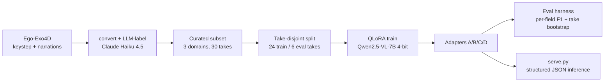

# EgoScribe

Compute-efficient adaptation of a Vision-Language Model for egocentric procedural understanding —
a controlled ablation study, not a fine-tuning demo.

## TL;DR

**Question:** Given a fixed, small compute budget, *where* should you place a LoRA adapter in a
VLM to improve egocentric hand-object-interaction understanding — the vision encoder, the language
decoder, or attention-only across both?

**What I did:** Trained four QLoRA adaptation strategies on Qwen2.5-VL-7B over the same curated
Ego-Exo4D subset, then evaluated them honestly on a held-out split — reporting **take-level
bootstrap confidence intervals**, including the cases where the data does *not* support a
conclusion. Whole study: **$16.25 of cloud compute, no local GPU.**

**Headline:** The strategy differences are within noise at this sample size, so no winner is
claimed. The defensible, noise-robust finding: **language-side adaptation matched full
vision+language adaptation at fewer trainable params, while vision-only lagged** — pointing to the
domain gap living on the description side, not the seeing side.

## Architecture



## Key findings

Token-F1 with 95% take-level bootstrap intervals over the six held-out takes. Full table and
per-field reasoning in [`docs/results_summary.md`](docs/results_summary.md); raw outputs in
[`docs/eval_out/`](docs/eval_out/).

| # | Strategy | Params | Valid JSON | Target F1 | Action F1 | State F1 |
|---|----------|-------:|-----------:|----------:|----------:|---------:|
| A | Vision + language, attn + MLP | 51.5M (0.62%) | 110/110 | 0.313 | 0.242 | 0.182 |
| B | Vision only, attn + MLP | 11.2M (0.13%) | 110/110 | 0.227 | 0.105 | 0.085 |
| C | Language only, attn + MLP | 40.4M (0.48%) | 110/110 | 0.323 | 0.251 | 0.191 |
| D | Both, attention only | 14.0M (0.17%) | 101/110 | 0.284 | 0.186 | 0.125 |

- **A and C are statistically indistinguishable** — intervals overlap almost completely. No
  "C beats A" claim.
- **Vision-only (B) is weakest** on the language-shaped fields — the closest thing to a real
  separation.
- **Point-of-no-return F1 is uninformative** (intervals span ~[0, 0.65] on five positives).
- **`safety_gear_missing` is unmeasurable** here — zero positive gold items in the held-out split.
  Reported as unavailable, not solved.

This is an **exploratory** result over six takes, not a definitive ranking.

## Methodology

- **Model:** Qwen2.5-VL-7B-Instruct, loaded 4-bit via Unsloth (`unsloth-bnb-4bit`), QLoRA + BF16
  mixed precision.
- **Strategies:** same base model, split, seed, and 3-epoch recipe for all four — only *where* the
  adapter lives changes (A broad, B vision-only, C language-only, D attention-only).
- **Data:** Ego-Exo4D egocentric views only. Three deliberately distinct domains (Covid rapid
  test / fix-a-flat / cook-an-omelet), 30 takes, LLM-labeled with Claude Haiku 4.5 (~$1.27).
- **Split:** by `take_uid`, not segment, to avoid context leakage — 572 train segments / 24 takes,
  110 eval / 6 takes.
- **Evaluation:** JSON schema validity, per-field token-F1, PONR binary F1, and a **take-level
  block bootstrap** — takes are the independent statistical unit, not segments.

## Implementation highlights

- **Take-level bootstrap.** Recognized that 110 segments are really six correlated takes; block
  bootstrap over take IDs gives honest (wide) intervals instead of false precision.
- **LLM-assisted labeling.** Cross-references keystep segments against `atomic_descriptions`
  narrations for richer extraction context — large quality jump over a naive `step_name` split.
- **Single-source prompt.** `src/dataset.py::USER_PROMPT_TEXT` is shared by training, eval, and
  serving, so nothing is evaluated on a distribution it was never trained on.
- **Adapter-aware serving.** `serve.py` reuses the eval loader/prompt/validation to run one saved
  checkpoint on one clip (code-ready; not yet run end-to-end on a GPU).

## Engineering decisions

Documented in [`adr/`](adr/):

- **[ADR-0001](adr/0001-model-selection.md)** — Qwen2.5-VL-7B over MiMo-VL.
- **[ADR-0002](adr/0002-adaptation-strategy-set.md)** — trimmed 8 candidate strategies to 4 to fit
  budget while still answering the question. (Also caught a real bug: Unsloth's four finetune
  switches are two axes — layers × module types — not four independent toggles.)
- **[ADR-0003](adr/0003-quantization-qlora.md)** — 4-bit QLoRA for a no-GPU budget.
- **[ADR-0004](adr/0004-dataset-subset-curation.md)** — curated 3-domain subset over full-corpus
  labeling (~$1.27 vs ~$25).

Cost: **$16.25 total** GCP compute (inside a free-trial credit, $0 out of pocket); ~$7 training,
rest VM overhead.

## Lessons learned

More in [`things-i-learned.md`](things-i-learned.md). The big one:

- **The study is underpowered, and that was a conscious cost tradeoff, not an oversight.** The
  independent unit is six held-out takes; take count was capped by labeling cost and a $16 budget,
  not by compute. **Next dollar would go to more *eval* takes (or k-fold over takes) — that buys
  statistical power a larger segment count never can.** Fewer domains with more takes each would
  also sharpen an A-vs-C ranking.
- Absolute semantic F1 is low; small data (572 train segments) and 3 epochs likely undertrain.
- Token-F1 on text fields structurally favors language-side adaptation — a confound on the
  "adapt language, not vision" reading, not independent proof of it.

## Quick start

Train one strategy:

```
python train.py --strategy A --annotations data/converted/annotations_train.json
```

Evaluate with take-level CIs:

```
python -m src.eval.evaluate --adapter saved_egoscribe_adapters/strategy_A \
  --annotations data/converted/annotations_eval.json
```

Serve one held-out example against a trained checkpoint (GPU):

```
python serve.py --annotations data/converted/annotations_eval.json \
  --video_dir data/ego-exo4d/takes --adapter saved_egoscribe_adapters/strategy_C --index 0
```

## docs/

- [`docs/results_summary.md`](docs/results_summary.md) — full comparison table, CIs, cost, primary
  metric reasoning.
- [`docs/eval_out/`](docs/eval_out/) — raw `strategy_*_clustered.json` outputs (reproducible source
  for every number above).
- [`adr/`](adr/) — engineering decision records.
- [`things-i-learned.md`](things-i-learned.md) — bugs and course-corrections.
